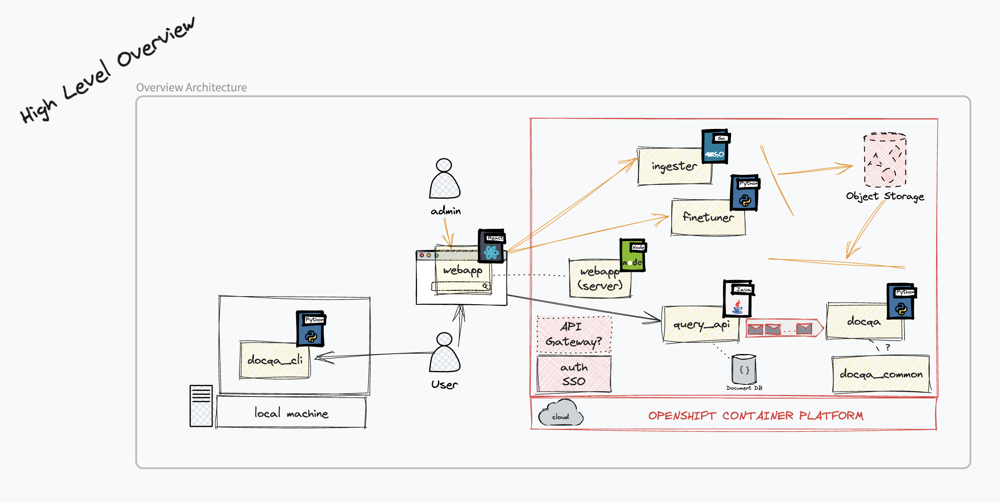

# psychdocs (DRAFT)
Using LLMs to access psychology docs via natural language. The plan is to build out several components:
* docqa_api
* [docqa_cli](./docqa_cli)
* finetuner
* ingester
* webapp

Right now the CLI works but the rest is still in work.

## arch sketch
DRAFT fits together like this:

