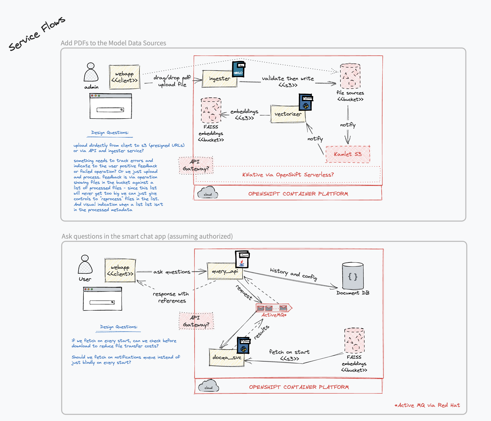
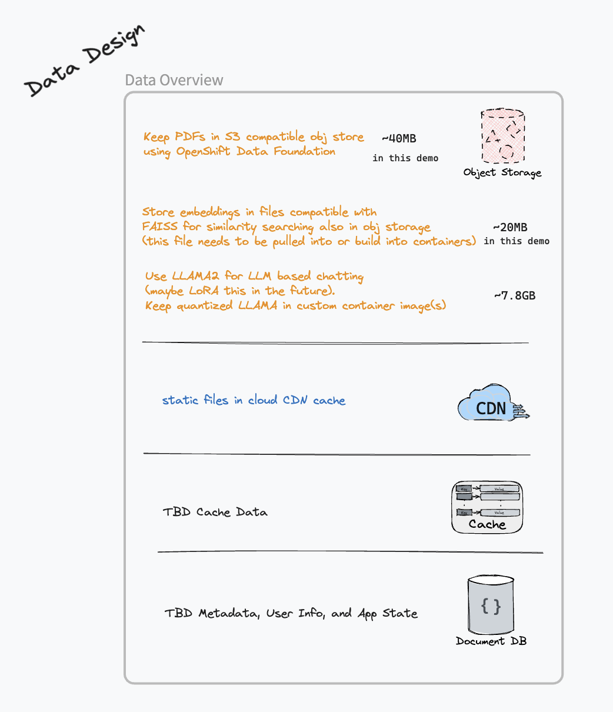

# psychdocs (DRAFT)
Using LLMs to access psychology docs via natural language. The plan is to build out several components:
* webapp
* query_api
* [ingester](./ingester)
* finetuner
* [docqa_cli](./docqa_cli)

Right now the CLI works but the rest is still in work.

## arch sketch
I've been iterating on the architecure design, [the DRAFT](https://excalidraw.com/#json=bc_tmEdGVW69KL_LR1VAC,TJTXQuB5d-ckQKvW4UNBGA) fits together like this:

Some early flow designs:

Initial data design thoughts:

