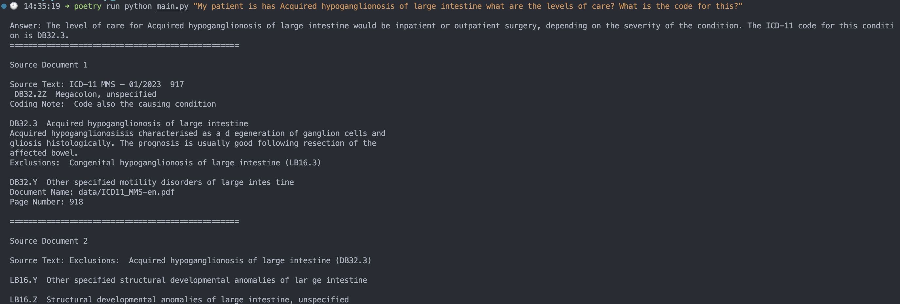

# doc QA CLI tool
Query the docs with this CLI tool.




## Running
The large downloads you need aren't in this repo, you'll need to download them yourself:
* get a [LLAMA2 model](https://huggingface.co/TheBloke/Llama-2-13B-chat-GGML) and save it to a folder called `models`
* get doc(s) to index for embeddings and save to a folder called `data`

install dependencies:
> ```poetry install```

build the vector database first:
> ```poetry run python gen_db_faiss.py```

Then you can run queries:
> ```poetry run python main.py "How much is stress is too much"```
